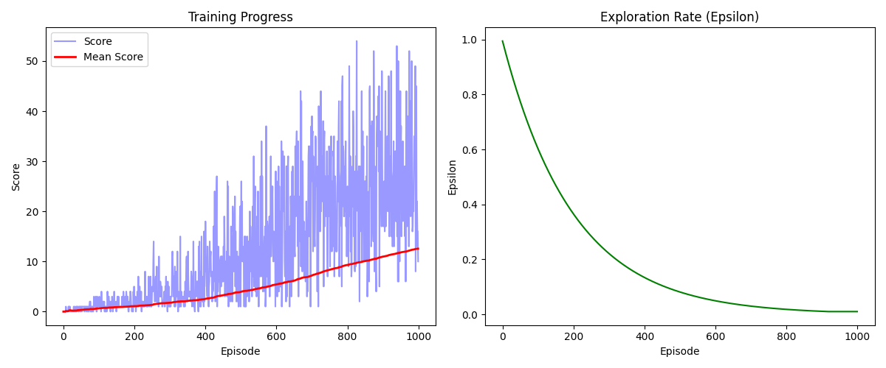

# 🐍 RL Snake Bot

A Reinforcement Learning agent that learns to play Snake from scratch using Deep Q-Network (DQN). Trained with PyTorch, tracked with MLflow, served via FastAPI, and visualized in a React frontend.




---

## Demo

The agent starts knowing nothing and learns purely through trial and error — reaching a best score of **58** after 1000 episodes.

**Live demo:** React frontend shows the AI playing Snake in real time, with Q-values updating every frame.

---

## Tech Stack

| Layer               | Technologies                             |
| ------------------- | ---------------------------------------- |
| RL Algorithm        | Deep Q-Network (DQN)                     |
| Framework           | PyTorch                                  |
| Game Environment    | Pygame + Gymnasium                       |
| Experiment Tracking | MLflow                                   |
| Backend API         | FastAPI                                  |
| Frontend            | React + TypeScript + Tailwind CSS + Vite |
| DevOps              | Docker + Docker Compose                  |

---

````markdown
## Project Structure

```text
rl-snake-bot/
├── game/                      # Pygame Snake + Gymnasium wrapper
│   ├── snake_game.py          # Core game logic
│   └── snake_env.py           # Gymnasium environment
├── agent/                     # DQN implementation
│   ├── model.py               # Neural network (DQN)
│   ├── replay_buffer.py       # Experience replay memory
│   ├── agent.py               # DQN agent (epsilon-greedy, learn)
│   ├── train.py               # Basic training loop
│   └── train_mlflow.py        # Training with MLflow tracking
├── api/                       # FastAPI service
│   ├── main.py                # Endpoints: /, /info, /predict
│   └── schemas.py             # Pydantic request/response models
├── config/                    # Hyperparameter config
│   └── training_config.py
├── frontend/                  # React live demo
│   └── src/
│       ├── components/        # SnakeCanvas, StatsPanel, Controls
│       ├── hooks/             # useSnakeGame (game loop + API calls)
│       └── types.ts
├── models/                    # Saved model checkpoints
├── Dockerfile.api
├── Dockerfile.frontend
└── docker-compose.yml
```

---


## How It Works

### State Space (11 values)

[danger_straight, danger_right, danger_left,
dir_left, dir_right, dir_up, dir_down,
food_left, food_right, food_up, food_down]

### Action Space (3 actions)

0 = go straight
1 = turn right
2 = turn left

### Reward Function

+10 eat food
-10 die (wall or self)
0 survive

### DQN Architecture

Input(11) → Linear → ReLU → Linear → ReLU → Linear → Output(3)
256 256

---

## Training Results

| Metric           | Value                      |
| ---------------- | -------------------------- |
| Episodes         | 1000                       |
| Best Score       | 58                         |
| Final Mean Score | 12.10                      |
| Algorithm        | DQN with experience replay |
| Device           | CPU                        |

---

## Run with Docker (recommended)

```bash
git clone https://github.com/M-Nusrat-Ullah/rl-snake-bot.git
cd rl-snake-bot
docker compose up
```

- Frontend: http://localhost:3000
- API docs: http://localhost:8000/docs

---

## Run Locally

### 1. Clone & setup

```bash
git clone https://github.com/M-Nusrat-Ullah/rl-snake-bot.git
cd rl-snake-bot
python -m venv venv
source venv/bin/activate
pip install -r requirements.txt
```

### 2. Train the agent

```bash
# Basic training
python -m agent.train

# Training with MLflow tracking
python -m agent.train_mlflow
mlflow ui   # open http://127.0.0.1:5000
```

### 3. Start the API

```bash
python -m uvicorn api.main:app --reload
# API docs at http://127.0.0.1:8000/docs
```

### 4. Start the frontend

```bash
cd frontend
npm install
npm run dev
# Open http://localhost:5173
```

---

## API Endpoints

| Method | Endpoint   | Description                |
| ------ | ---------- | -------------------------- |
| GET    | `/`        | Health check               |
| GET    | `/info`    | Model info                 |
| POST   | `/predict` | Get action from game state |

### Example predict request

```bash
curl -X POST http://127.0.0.1:8000/predict \
  -H "Content-Type: application/json" \
  -d '{"state": [0, 0, 0, 0, 1, 0, 0, 0, 1, 1, 0]}'
```

```json
{
  "action": 0,
  "action_name": "straight",
  "q_values": [5.51, 4.86, 5.51]
}
```

---

## Key Concepts Implemented

- **Deep Q-Network (DQN)** — neural network approximates Q-values
- **Experience Replay** — random sampling from 100k experience buffer
- **Epsilon-Greedy Exploration** — decays from 1.0 → 0.01 over training
- **Target Network** — separate frozen network for stable Q-targets
- **Gymnasium Interface** — standard RL environment wrapper

---

## Developer

**M Nusrat Ullah**
Software Engineer @ Nybsys, Dhaka
[GitHub](https://github.com/M-Nusrat-Ullah)

---

## License

MIT
````
